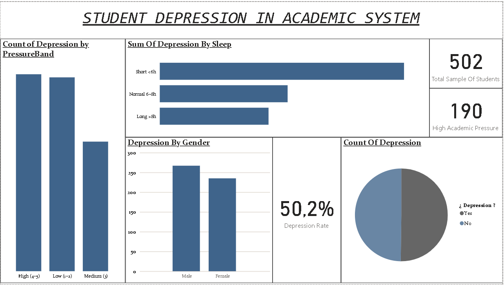
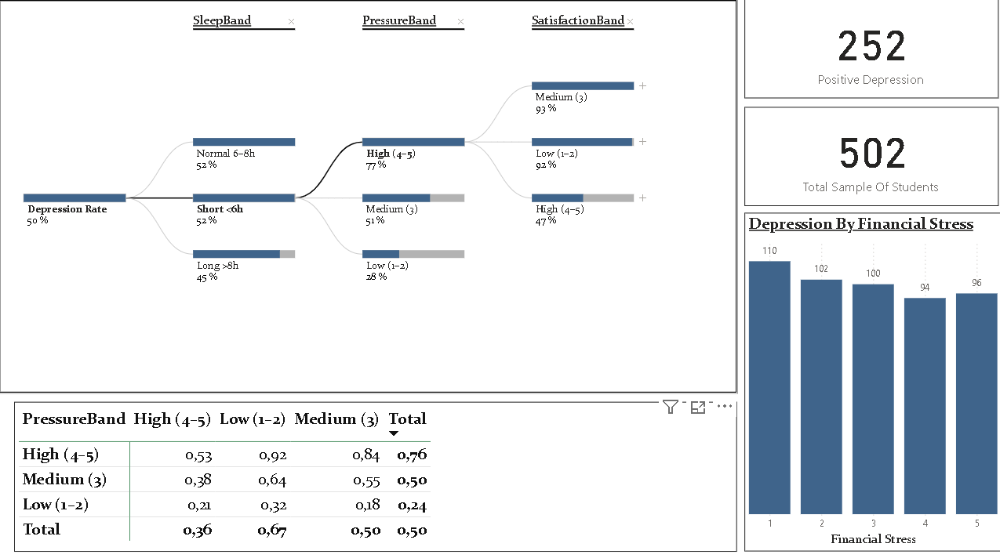
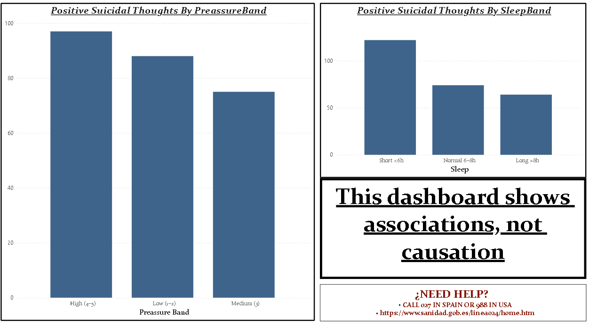

# Student-Depression-SQL-BI
SQL pipeline (Staging,Cleaning,Gold) + BI View

ENGLISH

# Student Depression — SQL Pipeline & Power BI

Data pipeline (SQL Server) + Power BI dashboard to explore associations in a student dataset.

## Architecture (stg → cln → gold)
- **/Sql/00_Staging-Profiling.sql**: initial load and profiling.
- **/Sql/01_Clean.sql**: normalization, typing/standardization, mappings and flags.
- **/Sql/02_Gold-Views.sql**: `vw_students_bi` and BI-ready views.
- Power BI consumes the **gold** views.

> Note: this repo includes SQL and screenshots only. The `.pbix` can be uploaded separately if it doesn’t contain sensitive data.

## Power BI pages
1. **Overview**: key metrics (Depression Rate, band distributions).
2. **Drivers**: bar/stacked visuals by Sleep Band, Pressure Band, Satisfaction, etc.
3. **Decomposition Tree**: guided exploration (Sleep → Pressure → Satisfaction → Financial Stress → Gender → Family History).
4. **About**: pipeline description and a simple stg→cln→gold→BI diagram.

### Dashboard notices
- “This dashboard shows associations; **it does not prove causality**.”
- “If you or someone you know needs help, please reach out to local resources.”
- “‘Unknown’ values represent missing or non-standard responses.”

## Reproducibility (quick start)
1. Run `00_Staging-Profiling.sql` → `01_Clean.sql` → `02_Gold-Views.sql` on your SQL Server instance.
2. In Power BI Desktop, connect to the DB and the `vw_*` views in the gold layer.
3. Refresh the model.

## Repository structure

/Documents
/Sql
├── 00_Staging-Profiling.sql
├── 01_Clean.sql
└── 02_Gold-Views.sql
/docs
└── img
├── overview.png
├── drivers.png
├── decomposition-tree.png
└── about.png
README.md

## Stack
SQL Server · Power BI · basic DAX · Power Query (M) · Star-schema modeling (gold views)

## 👋 Contact
Julián B. — Data & BI  
https://www.linkedin.com/in/julian-bauza/

------------------------------------------------------------------------------------------------------------------------------------------------------------------------------------------------

                    ESPAÑOL

# Student Depression — SQL Pipeline & Power BI

Pipeline de datos (SQL Server) + dashboard en Power BI para explorar asociaciones en un conjunto de estudiantes.

## Demo (capturas)

## Arquitectura (stg → cln → gold)
- **/Sql/00_Staging-Profiling.sql**: carga y perfilado inicial.
- **/Sql/01_Clean.sql**: normalización, tipificación, mapeos y flags.
- **/Sql/02_Gold-Views.sql**: `vw_students_bi` y vistas listas para BI.
- Power BI consume las vistas **gold**.

> Nota: el repo incluye solo SQL y capturas. El `.pbix` puede subirse aparte si no contiene datos sensibles.

## Páginas del Power BI
1. **Overview**: métricas clave (Depression Rate, distribución por bandas).
2. **Drivers**: barras/apilados por Sleep Band, Pressure Band, Satisfaction, etc.
3. **Decomposition Tree**: exploración guiada (Sleep → Pressure → Satisfaction → Financial Stress → Gender → Family History).
4. **About**: descripción del pipeline y diagrama simple stg→cln→gold→BI.

### Avisos en el dashboard
- “Este dashboard muestra asociaciones; **no prueba causalidad**.”
- “Si tú o alguien que conoces necesita ayuda, contacta a los recursos locales.”
- “Valores ‘Unknown’ representan respuestas faltantes o no estándar.”

## Reproducibilidad (resumen)
1. Ejecutar `00_Staging-Profiling.sql` → `01_Clean.sql` → `02_Gold-Views.sql` en tu instancia de SQL Server.
2. En Power BI Desktop, conectar a la BD y a las vistas `vw_*` de la capa gold.
3. Refrescar el modelo.

## Estructura del repositorio

/Documents
/Sql
├── 00_Staging-Profiling.sql
├── 01_Clean.sql
└── 02_Gold-Views.sql
/docs
└── img
├── overview.png
├── drivers.png
├── decomposition-tree.png
└── about.png
README.md

--------------------------------------------------------------------------------------

## Stack
SQL Server · Power BI · DAX básico · Power Query (M) · Modelado estrella (vistas gold)

## 👋 Contacto
Julián B. — Data & BI
https://www.linkedin.com/in/julian-bauza/

